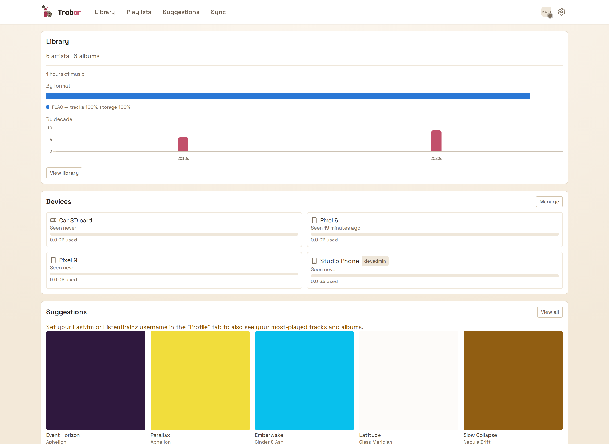
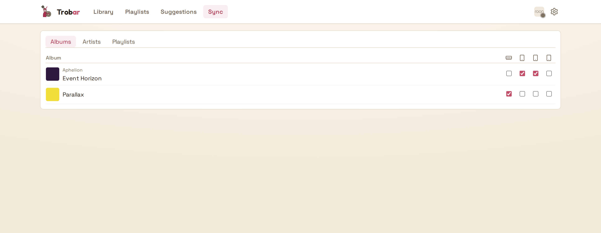
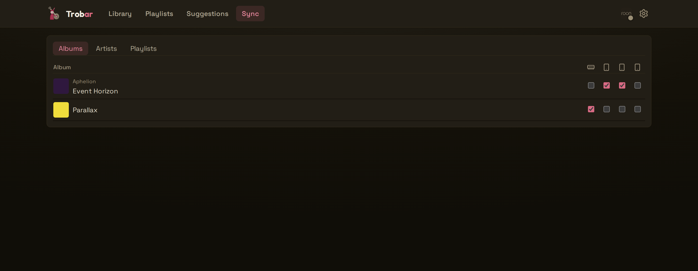

<!--
SPDX-FileCopyrightText: 2026 missing-foss

SPDX-License-Identifier: AGPL-3.0-or-later
-->

# Trobar

[](https://securityscorecards.dev/viewer/?uri=github.com/missing-foss/trobar-server)

A self-hosted, multi-user music library sync: pick artists, albums, or playlists and keep them offline on Android phones, tablets, watches, dedicated audio players (DAPs), or any mass-storage device — an SD card, a USB drive, a laptop's own folder. Files are copied as-is by default — byte-for-byte, no quality loss — with optional per-device MP3 transcoding for space-limited cards.

📖 **Full documentation: [missing-foss.github.io/trobar-server](https://missing-foss.github.io/trobar-server/)**

## Why

Most "sync your music" tools either lock you into a single streaming service or need constant online access. Trobar works differently:

- **Filesystem-first.** Your library lives on disk in whatever folder structure you already have. A provider (Roon, Jellyfin, Emby, Plex, LMS, or any Subsonic server) is an optional layer on top (playlists) — the core sync never depends on one being online, or existing at all.
- **Your files, untouched.** What's in your library is what lands on the device, byte-for-byte — unless you *ask* for MP3 transcoding on a device, in which case the server does the conversion on the fly, never altering your originals.
- **Multi-user by design.** Every household member gets their own account, their own devices, and their own sync selections, with optional delegation so one person can manage another's device (e.g. a parent managing a kid's phone).
- **Works with or without SSO.** Sign in via any OpenID Connect provider (Authentik, Authelia, Keycloak, …) with the app verifying the token itself, sit behind a ForwardAuth reverse proxy, or run standalone with its own local accounts — your choice, none required for the others to work.
- **No telemetry, no CDN.** Nothing phones home, nothing is tracked, and every web asset (fonts, scripts, icons) is served from your own instance. The only outbound requests are the integrations you configure (Last.fm, TheAudioDB, your provider) — plus Gravatar avatars for SSO users who haven't uploaded a picture, the one documented exception.

## Why the name?

*Trobar* is Occitan for "to find" — the verb the troubadours got their name from: musicians who owned their songs and carried them from court to court. That's the whole idea here: find the music you care about, keep it, carry it. The full story (and the reason there's a smug bard in the logo) is in [Why "Trobar"](https://missing-foss.github.io/trobar-server/project/why-trobar/).

## Screenshots

| Home | Sync matrix | Dark theme |
|---|---|---|
|  |  |  |

Captured against the synthetic, invented test library in `dev/` — no real or copyrighted content. The rest (library, playlists, suggestions, login, first-run wizard — each with a light/dark variant) is in [`docs/screenshots/`](docs/screenshots/).

## Quickstart

Trobar runs as a single Docker container (Flask + SQLite) alongside your existing music library, mounted read-only.

```bash
git clone https://github.com/missing-foss/trobar-server
cd trobar-server
cp .env.example .env   # set MUSIC_ROOT, DATA_DIR, ADMIN_USERNAME, AUTH_MODE
docker compose up -d --build
```

Two things to get right up front: **set `ADMIN_USERNAME` before first launch** (in `local` mode the first visit claims the admin account), and **run it behind a TLS-terminating reverse proxy** — never expose the container port directly.

Everything else — the full environment-variable reference, the auth modes (local / OIDC / forward), the first-run wizard, reverse-proxy and `DATA_DIR` ownership, and upgrading — lives in the docs:

- [Installation & Deployment](https://missing-foss.github.io/trobar-server/getting-started/installation/) · [Authentication Modes](https://missing-foss.github.io/trobar-server/getting-started/authentication/) · [Environment Variables](https://missing-foss.github.io/trobar-server/reference/environment/) · [Upgrading](https://missing-foss.github.io/trobar-server/operations/upgrading/)

## Features

- Browse the library by artist/album, batch-select, and sync to any combination of devices.
- Suggestions from recently-added, top-played, and recently-played — filtered to what's in your library and not already synced.
- Optional playlist providers (Roon, Jellyfin, Emby, Plex, LMS, any Subsonic server) plus per-user Tidal accounts (and Spotify, experimental — off by default, see [the provider docs](https://missing-foss.github.io/trobar-server/providers/spotify/)); playlists land as ordered `.m3u8` files.
- Import playlists from an exported iTunes / Apple Music `Library.xml` — works alongside any provider.
- Per-device storage limits, auto-fit from listening history, and optional MP3 transcoding (320/256/192/128 kbit/s) with honest storage accounting.
- Multi-user with delegated management; admin panel with live provider/API-key config and light/dark/system theming.
- No telemetry — see the [documentation](https://missing-foss.github.io/trobar-server/) for the full picture.

## Clients

- **Android** ([trobar-android](https://github.com/missing-foss/trobar-android)) — QR pairing, background sync, network-type restrictions.
- **Desktop** ([trobar-desktop](https://github.com/missing-foss/trobar-desktop), Flutter — Linux/macOS/Windows) — syncs any mass-storage target (DAP SD cards, USB drives, a folder on the computer).
- **Garmin** ([trobar-garmin](https://github.com/missing-foss/trobar-garmin), Connect IQ / Monkey C) — plays through the watch's own native Music player, sideload-only for now.

Pairing and usage walkthroughs are in the [Clients guide](https://missing-foss.github.io/trobar-server/clients/).

Want a household dashboard instead of another sync target? See the
**[Home Assistant integration](https://github.com/missing-foss/trobar-ha)**
— not a client (it doesn't sync music anywhere), a monitoring/automation
surface over sync status. Details in the
[Home Assistant Integration reference](https://missing-foss.github.io/trobar-server/reference/home-assistant/).

## Security

See [SECURITY.md](SECURITY.md) for the threat model, the hardening in place, and the intentional access boundaries — in short: run it **behind a TLS-terminating reverse proxy** (never expose the container port directly), and treat `DATA_DIR` like a password store (it holds plaintext provider credentials and the session key — back it up encrypted). To report a vulnerability, use GitHub's private vulnerability reporting or email **missing_foss@etik.com**.

## Documentation

Full documentation is published at
**[missing-foss.github.io/trobar-server](https://missing-foss.github.io/trobar-server/)**
(built from [`docs/`](docs/) in this repo):

- [Getting Started](https://missing-foss.github.io/trobar-server/getting-started/installation/) — install & deploy, first-run wizard, authentication modes
- [Providers](https://missing-foss.github.io/trobar-server/providers/) — Roon (incl. the pairing dance), Jellyfin, Emby, Plex, LMS, the Subsonic ecosystem, Filesystem (incl. iTunes/Apple Music import), personal Tidal accounts, and personal Spotify accounts (experimental)
- [Using Trobar](https://missing-foss.github.io/trobar-server/using/library-selections/) — library & selections, suggestions, playlists, devices & storage, delegation
- [Clients](https://missing-foss.github.io/trobar-server/clients/) — Android, desktop, and Garmin
- [Administration](https://missing-foss.github.io/trobar-server/administration/) · [Operations](https://missing-foss.github.io/trobar-server/operations/networking/) · [Troubleshooting](https://missing-foss.github.io/trobar-server/troubleshooting/) · [Reference](https://missing-foss.github.io/trobar-server/reference/environment/)
- Contributing a translation? See [Translating Trobar](https://missing-foss.github.io/trobar-server/project/translations/)

## License

- **Server** (this repository): GNU Affero General Public License, version 3 or (at your option) any later version (`AGPL-3.0-or-later`) — see [LICENSE](LICENSE)
- **Android app** ([trobar-android](https://github.com/missing-foss/trobar-android)): GNU General Public License, version 3 or (at your option) any later version (`GPL-3.0-or-later`)
- **Desktop app** ([trobar-desktop](https://github.com/missing-foss/trobar-desktop)): GNU General Public License, version 3 or (at your option) any later version (`GPL-3.0-or-later`)
- **Garmin app** ([trobar-garmin](https://github.com/missing-foss/trobar-garmin)): GNU General Public License, version 3 or (at your option) any later version (`GPL-3.0-or-later`)
- **Home Assistant integration** ([trobar-ha](https://github.com/missing-foss/trobar-ha)): GNU General Public License, version 3 or (at your option) any later version (`GPL-3.0-or-later`)

Bundled third-party components (fonts, web libraries, Android dependencies) keep their own licenses — see [THIRD_PARTY_NOTICES.md](THIRD_PARTY_NOTICES.md).
